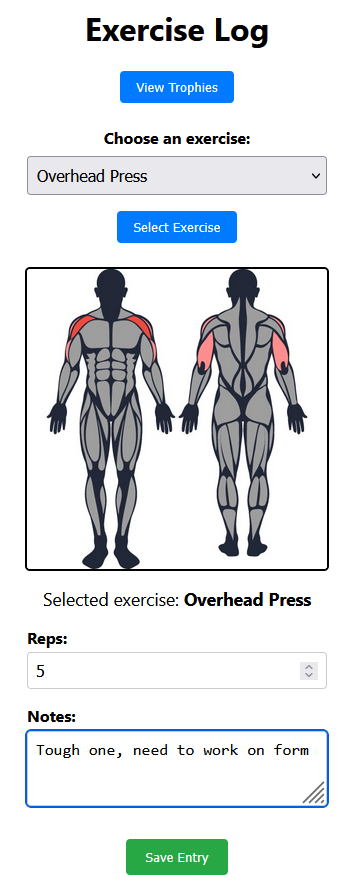
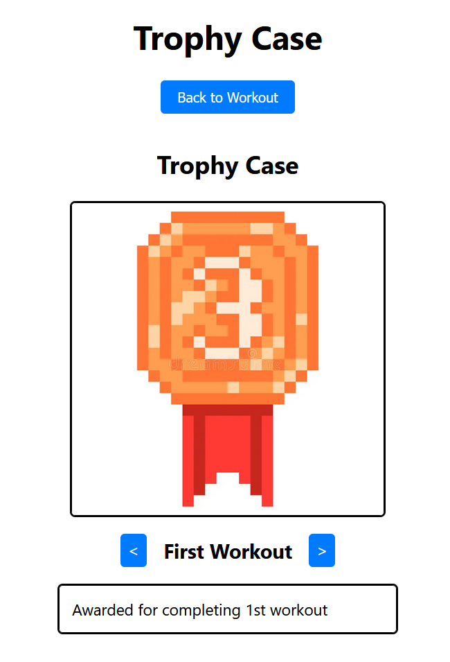

### This project was created using **React** for frontend, **Flask** for backend, and **MySQL (via Railway)** for database, to create a fitness tracker and incentivizer to help users **achieve their goals**

# Demonstration

## Logging In and Password Reset
Upon booting the app, users will be greeted with a professional-grade login screen. Here inputs will be validated to make sure they are of the form of a valid email.

If the user selects "Forgot Password" they will be greeted with a new window.

Here they can either proceed with the "Reset Password" button, which will update their credentials in the database.
Alternatively, the user can return "Back to Login" which will clear the form they are working on, and return back to the homepage.

## Logging Exercises
Once the user selects "Log In" with proper credentials, they will be met with the largest feature of the app the "Exercise Log"
Here the user can select from a dropdown of a plethora of exercises, select a number of reps performed, and add notes describing the particular instance of the exercise.
By selecting different exercises from the dropdown, the user will be able to see the muscle groups targeted by the exercise in the display window.
Upon selecting "Save Entry" the exercise will be logged to the database.

## Rewards
If the user selects "View Trophies" from the "Exercise Log" screen, they will be met with yet enough page, this one showing all of their achievements so far.
Examples included for viewing include the first trophy for completing an exercise, the fiftieth exercise trophy, and a trophy that has not yet been unlocked by this user!

# Setup

## Running the DB

### Create a **_.env_** file in the fitness-backend folder (same location as app.py) & insert the code:

_to create the `.env` file, just create a new file and call it .env_

**CODE:**

DB_HOST=your-db-host

DB_PORT=your-db-port

DB_USER=your-db-user

DB_PASSWORD=your-db-password

DB_NAME=FitnessAppDB

_Please contact Nhi for the information on the DB since these are just placeholders due to security risks._

### Install dependencies:

`pip install -r requirements.txt`

### Connect to SQL Server:

1. Navigate to fitness-backend folder
2. enter the mysql command `mysql -h caboose.proxy.rlwy.net -P 53416 -u root -p --ssl-mode=REQUIRED railway`
3. enter password
4. YOU'RE IN!

### Start the Flask Sever

Navigate to fitness-backend and run `python app.py`

### Start the React Server

Navigate to fitness-frontend and run `npm run start`

### The React, Flask, and Database should be open in three separate command line interfaces.
Open browser: visit localhost:3000 & localhost:5000 in two separate tabs

